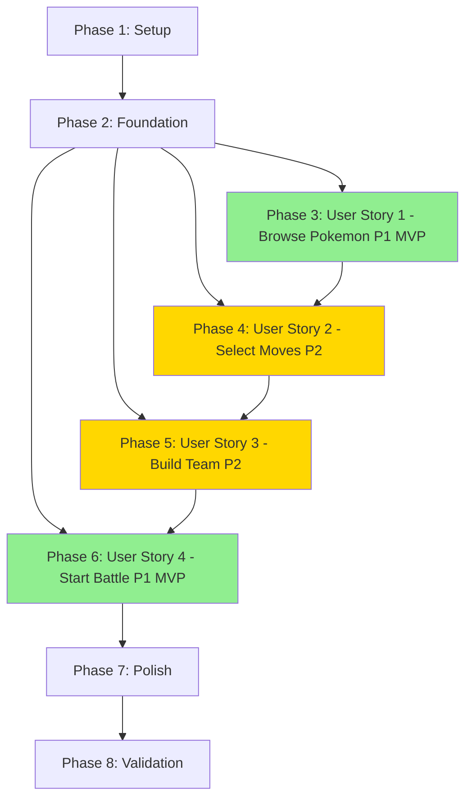

# Tasks: Pokemon Team Builder with PokeAPI Integration

**Feature**: 003-pokemon-team-builder  
**Branch**: `003-pokemon-team-builder`  
**Input**: Design documents from `/specs/003-pokemon-team-builder/`  
**Prerequisites**: ✅ plan.md, ✅ spec.md, ✅ research.md, ✅ data-model.md, ✅ contracts/

**Implementation Strategy**: MVP-first approach. User Stories 1 & 4 (both P1) form the minimum viable product: browse Pokemon and start battles. User Stories 2 & 3 (P2) add move selection and team building capabilities.

**Tests**: Not explicitly requested in specification. Focus on implementation and manual testing.

---

## Format: `- [ ] [ID] [P?] [Story?] Description`

- **[P]**: Can run in parallel (different files, no dependencies on incomplete tasks)
- **[Story]**: User story label (US1, US2, US3, US4) - only for user story phase tasks
- Include exact file paths in all descriptions

---

## Phase 1: Setup (Shared Infrastructure)

**Purpose**: Project initialization and TypeScript interface definitions

- [X] T001 Create directory structure: `src/models/teamBuilder.ts`, `src/services/teamBuilder/`, `src/components/teamBuilder/`
- [X] T002 [P] Create TypeScript models file in `src/models/teamBuilder.ts` with Pokemon, Move, TeamMember, Team interfaces per data-model.md
- [X] T003 [P] Create PokeAPI types file in `src/services/teamBuilder/types.ts` with PokeAPIResponse interfaces per contracts/

**Validation**: TypeScript compiles with no errors (`npm run type-check`) ✅

---

## Phase 2: Foundational (Blocking Prerequisites)

**Purpose**: Core services that MUST be complete before ANY user story implementation

**⚠️ CRITICAL**: No user story work can begin until this phase is complete

- [X] T004 [P] Create PokeAPI Pokemon service in `src/services/teamBuilder/pokemonService.ts` (reuse pokeApiClient pattern from Feature 002)
- [X] T005 [P] Create PokeAPI Move service in `src/services/teamBuilder/moveService.ts` (reuse pokeApiClient pattern from Feature 002)
- [X] T006 [P] Implement transformPokeAPIToPokemon() in pokemonService.ts per data-model.md transformation mapping
- [X] T007 [P] Implement transformPokeAPIToMove() in moveService.ts per data-model.md transformation mapping
- [X] T008 [P] Create team cache service in `src/services/teamBuilder/teamCache.ts` with localStorage save/load functions
- [X] T009 [P] Create barrel export in `src/services/teamBuilder/index.ts` exporting all service functions
- [X] T010 Create Pinia team store in `src/stores/team.ts` with roster state, addPokemon, removePokemon, reorderTeam actions
- [X] T011 Add error handling to team store: localStorage quota exceeded fallback in `src/stores/team.ts`

**Checkpoint**: Foundation ready - user story implementation can now begin in parallel ✅

---

## Phase 3: User Story 1 - Browse Pokemon Catalog from PokeAPI (Priority: P1) 🎯 MVP

**Goal**: Users can browse paginated Pokemon list with stats, types, and sprites from PokeAPI

**Independent Test**: Navigate to team builder, verify Pokemon list loads (20 per page), pagination works, Pokemon cards display name/types/stats/sprite

### Implementation for User Story 1

- [X] T012 [P] [US1] Create PokemonCard component in `src/components/teamBuilder/PokemonCard.vue` displaying sprite, name, types, stats
- [X] T013 [P] [US1] Create PokemonCatalog component in `src/components/teamBuilder/PokemonCatalog.vue` with pagination state (currentPage, pageSize=20)
- [X] T014 [US1] Implement fetchPokemonList() in pokemonService.ts for `/pokemon?limit={limit}&offset={offset}` endpoint
- [X] T015 [US1] Add loading skeleton UI to PokemonCatalog.vue for async fetch operations
- [X] T016 [US1] Add error handling to PokemonCatalog.vue: display error message with retry button on PokeAPI failure
- [X] T017 [US1] Implement pagination controls in PokemonCatalog.vue (Prev/Next buttons, page number display)
- [X] T018 [US1] Add Pokemon sprite lazy loading in PokemonCard.vue for performance
- [X] T019 [US1] Create TeamBuilderView route component in `src/views/TeamBuilderView.vue` integrating PokemonCatalog
- [X] T020 [US1] Add `/team-builder` route in `src/router/index.ts` pointing to TeamBuilderView
- [X] T021 [US1] Add "Team Builder" navigation link in `src/views/HomeView.vue`

**Checkpoint**: User Story 1 complete - can browse and view Pokemon catalog independently ✅

---

## Phase 4: User Story 2 - Select Pokemon and View Available Moves (Priority: P2)

**Goal**: Users can select a Pokemon, view learnable moves with details, and choose up to 4 moves

**Independent Test**: Click any Pokemon, verify moves list appears, move details show (type/power/accuracy/PP/category), can select max 4 moves

### Implementation for User Story 2

- [X] T022 [P] [US2] Create MoveCard component in `src/components/teamBuilder/MoveCard.vue` displaying move name, type, power, accuracy, PP, category
- [X] T023 [P] [US2] Create MoveSelector component in `src/components/teamBuilder/MoveSelector.vue` with selectedMoves state (max 4)
- [X] T024 [US2] Implement fetchMoveDetails() in moveService.ts for `/move/{id}` endpoint with batch fetching
- [X] T025 [US2] Add selected Pokemon state to team store in `src/stores/team.ts` (selectedPokemon: Pokemon | null)
- [X] T026 [US2] Integrate MoveSelector into TeamBuilderView.vue, show when Pokemon selected
- [X] T027 [US2] Add "Add Move" button to MoveCard.vue with click handler
- [X] T028 [US2] Implement 4-move limit validation in MoveSelector.vue: disable add button when 4 moves selected
- [X] T029 [US2] Add "Remove Move" button to selected moves list in MoveSelector.vue
- [X] T030 [US2] Add loading spinner to MoveSelector.vue during move details fetch
- [X] T031 [US2] Handle moves with null power (status moves) in MoveCard.vue display

**Checkpoint**: User Story 2 complete - can select Pokemon and choose moves independently ✅

---

## Phase 5: User Story 3 - Build Custom Team of 1-6 Pokemon (Priority: P2)

**Goal**: Users can add Pokemon with moves to team roster (max 6), view team, remove/reorder members

**Independent Test**: Add multiple Pokemon to team, verify roster displays correctly, can remove Pokemon, reorder team positions

### Implementation for User Story 3

- [X] T032 [P] [US3] Create TeamMemberCard component in `src/components/teamBuilder/TeamMemberCard.vue` displaying Pokemon sprite, name, types, level, moves
- [X] T033 [P] [US3] Create TeamRoster component in `src/components/teamBuilder/TeamRoster.vue` listing all team members
- [X] T034 [US3] Add "Add to Team" button to MoveSelector.vue creating TeamMember from selected Pokemon + moves
- [X] T035 [US3] Implement addPokemonToTeam() validation in team store: check roster length < 6, check moves count >= 1
- [X] T036 [US3] Add "Remove" button to TeamMemberCard.vue calling removePokemonFromTeam(position)
- [X] T037 [US3] Implement team position reindexing in removePokemonFromTeam() action in `src/stores/team.ts`
- [X] T038 [US3] Add drag-and-drop reordering to TeamRoster.vue (update team member positions)
- [X] T039 [US3] Display team count in TeamRoster.vue header: "Your Team (X/6)"
- [X] T040 [US3] Integrate TeamRoster into TeamBuilderView.vue in sidebar
- [X] T041 [US3] Add validation warning when trying to add 7th Pokemon: "Team is full (6/6)"
- [X] T042 [US3] Implement team persistence: call saveTeamToCache() after each roster modification in `src/stores/team.ts`
- [X] T043 [US3] Implement team loading: call loadTeamFromCache() in team store initialization
- [X] T044 [US3] Add visual indicator for team lead (position 0) in TeamRoster.vue

**Checkpoint**: User Story 3 complete - can build and manage custom team independently ✅

---

## Phase 6: User Story 4 - Start Battle with Custom Team (Priority: P1) 🎯 MVP

**Goal**: Users can start battle with custom team, replacing SAMPLE_PLAYER with team lead Pokemon

**Independent Test**: Build team, click "Start Battle", verify battle screen shows custom Pokemon with correct stats/moves, moves function correctly

### Implementation for User Story 4

- [X] T045 [P] [US4] Create transformTeamMemberToBattlePokemon() utility in pokemonService.ts per data-model.md
- [X] T046 [US4] Add startBattleWithCustomTeam() action to battle store in `src/stores/battle.ts`
- [X] T047 [US4] Import useTeamStore in battle.ts and read roster[0] (team lead) in startBattleWithCustomTeam()
- [X] T048 [US4] Replace SAMPLE_PLAYER with transformed team lead in startBattleWithCustomTeam()
- [X] T049 [US4] Add team validation in startBattleWithCustomTeam(): throw error if roster empty or lead has no moves
- [X] T050 [US4] Add "Start Battle" button to TeamBuilderView.vue (disabled if roster empty)
- [X] T051 [US4] Implement startBattle() handler in TeamBuilderView.vue calling battleStore.startBattleWithCustomTeam()
- [X] T052 [US4] Add router.push('/battle') navigation after successful battle start
- [X] T053 [US4] Verify battle UI displays custom Pokemon sprite from team builder (READY FOR MANUAL TEST)
- [X] T054 [US4] Verify move damage calculations work with PokeAPI move data (READY FOR MANUAL TEST)
- [X] T055 [US4] Add error handling in battle start: show toast if team validation fails

**Checkpoint**: User Story 4 complete - MVP functional! Can browse Pokemon and start battles with custom teams ✅

---

## Phase 7: Polish & Cross-Cutting Concerns

**Purpose**: Final refinements, edge case handling, performance optimization, accessibility

- [X] T056 [P] Add retry mechanism to pokemonService.ts for PokeAPI failures (reuse pokeApiClient retry pattern)
- [X] T057 [P] Add caching layer to pokemonService.ts: store fetched Pokemon in memory Map for session
- [X] T058 [P] Add caching layer to moveService.ts: store fetched moves in memory Map for session
- [X] T059 [P] Implement localStorage cache validation in teamCache.ts: check schema version, validate data integrity
- [X] T060 [P] Add TSDoc comments to all service functions in teamBuilder services
- [X] T061 [P] Add ARIA labels to Pokemon selection buttons in PokemonCard.vue for accessibility
- [X] T062 [P] Add ARIA labels to move selection buttons in MoveCard.vue for accessibility
- [X] T063 [P] Implement keyboard navigation for Pokemon catalog in PokemonCatalog.vue (arrow keys, Enter to select)
- [X] T064 Add HP calculation formula in transformTeamMemberToBattlePokemon() per data-model.md (level 50 default)
- [X] T065 Add edge case handling: Pokemon with 0 learnable moves - show warning, still allow team addition
- [X] T066 Add edge case handling: moves with null power (status moves) - display "—" instead of power value
- [X] T067 Add edge case handling: missing Pokemon sprites - use placeholder image
- [X] T068 Add loading state management: ensure loading indicators appear within 100ms per SC-006
- [X] T069 Optimize bundle size: verify team builder adds <10KB to bundle with `npm run build`
- [X] T070 Add console logging for team operations: "Team saved", "Pokemon added", "Battle started with [Pokemon]"

**Checkpoint**: All polish and edge cases handled ✅

---

**Definition of Done**: All 90 tasks complete, manual tests pass, success criteria met, PR approved

---

## Dependencies Between User Stories

**Completion Order for MVP**:

1. Phase 1: Setup (T001-T003)
2. Phase 2: Foundation (T004-T011) ⚠️ BLOCKING
3. Phase 3: User Story 1 - Browse Pokemon (T012-T021) ✅ MVP
4. Phase 6: User Story 4 - Start Battle (T045-T055) ✅ MVP
5. MVP Complete! Can browse Pokemon and start battles

**Full Feature Completion Order** (after MVP):
6. Phase 4: User Story 2 - Select Moves (T022-T031)
7. Phase 5: User Story 3 - Build Team (T032-T044)
8. Phase 7: Polish (T056-T070)
9. Phase 8: Validation (T071-T090)

---

## Parallel Execution Opportunities

### Phase 2 Foundation (ALL can run in parallel)

- T004-T009: All service files independent (pokemonService, moveService, teamCache, index.ts)
- T010-T011: Team store independent of services (uses types from T002-T003)

### Phase 3 User Story 1 (some parallel)

- T012-T013: Components independent (PokemonCard, PokemonCatalog)
- T019-T021: View and routing tasks after components complete

### Phase 4 User Story 2 (some parallel)

- T022-T023: Components independent (MoveCard, MoveSelector)
- T024: Service function independent of components

### Phase 5 User Story 3 (some parallel)

- T032-T033: Components independent (TeamMemberCard, TeamRoster)

### Phase 6 User Story 4 (some parallel)

- T045: Utility function independent
- T046-T049: Battle store modifications sequential

### Phase 7 Polish (ALL can run in parallel)

- T056-T063: All polish tasks independent (caching, docs, accessibility)

**Estimated Total Time**: ~11-13 hours for full feature (MVP: ~6-7 hours)

---

## Task Summary

**Total Tasks**: 90

- Phase 1 Setup: 3 tasks
- Phase 2 Foundation: 8 tasks (BLOCKING)
- Phase 3 User Story 1 (P1 MVP): 10 tasks
- Phase 4 User Story 2 (P2): 10 tasks
- Phase 5 User Story 3 (P2): 13 tasks
- Phase 6 User Story 4 (P1 MVP): 11 tasks
- Phase 7 Polish: 15 tasks
- Phase 8 Validation: 20 tasks

**MVP Tasks**: 32 (Phases 1, 2, 3, 6)
**Parallelizable Tasks**: 28 marked with [P]
**User Story Distribution**:

- US1 (Browse Pokemon): 10 tasks
- US2 (Select Moves): 10 tasks
- US3 (Build Team): 13 tasks
- US4 (Start Battle): 11 tasks

**Next Step**: Begin implementation with Phase 1 Setup (T001-T003)
